# [Dataset](https://www.kaggle.com/datasets/olistbr/brazilian-ecommerce/)
## About
###   This is the Gen AI based agentic system which lets the users get insights on the structured dataset related to operations 
## 🚀 Key Features
🗣️ 1. Voice & Text Query System
📈 2. KPIs (Key Performance Indicators)
⚡ 3. Quick Insights
🧠 4. AI-Driven Query Interpretation
🔄 5. Yearly, Quarterly & Group Comparisons
🔮 6. Sales Forecasting
## ⚡ Quick Insights

Quick insights will basically helps user understands various aspects of data like what columns are there in dataset
,In each category which one are performing well.Here in the given quick insights we can get quick insights on product categories,products,city,states.
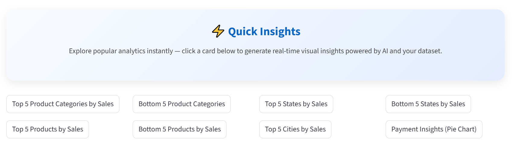
One-click insights to instantly generate charts for:

 ## 1.Top / Bottom 5 Product Categories
 
 ## 2.Top / Bottom 5 States
 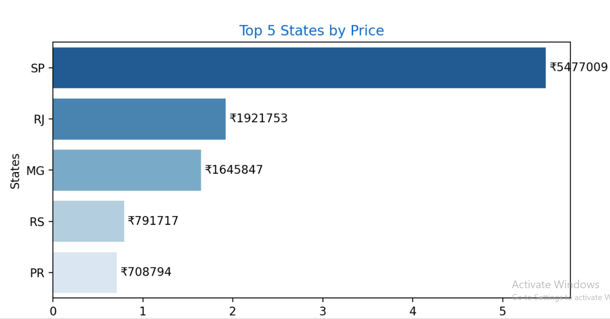
 ## 3.Payment Method Distribution (Pie Chart)
 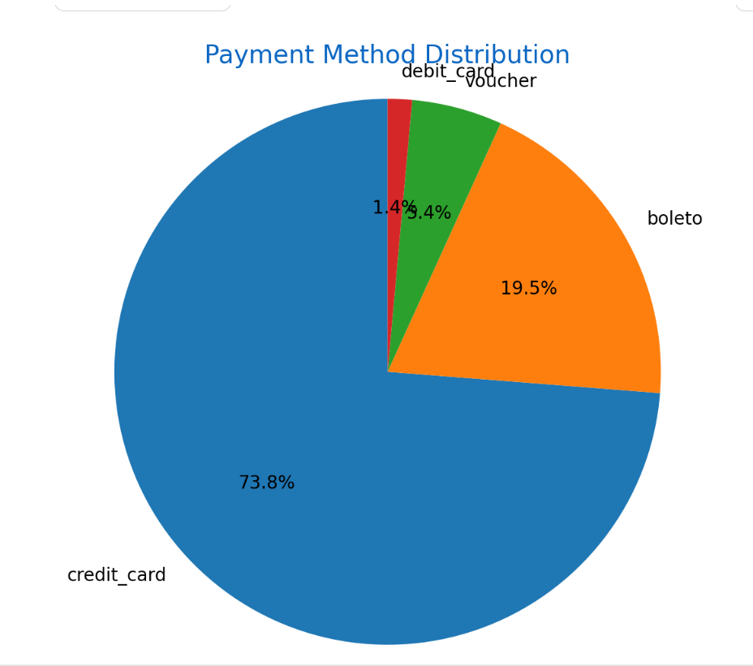
 Each insight opens a dynamic bar/pie chart.

## 🧠  AI-Driven Query Interpretation
### In this part we can ask agent various aspects of data and agent will answer accordingly and it not only gives answers but also it will give various graphs like bargraph ,pie chart ,lines etc to represent outcome visually in diagrams so it will help user to have better experience
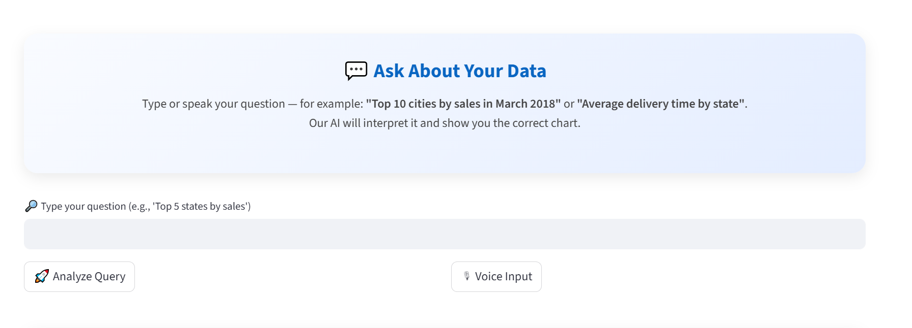
### The system understands natural language and automatically:

#### 1.Detects category (cities, states, products, sellers)
#### 2.Detects aggregation (sum, avg, count)
#### 3.Detects top/bottom N
#### 4.Detects rank (3rd highest, 2nd lowest)
#### 5.Detects time filters (months like April 2018)
#### 6.Detects comparison queries (e.g., compare 2017 vs 2018)
#### 7.Detects forecasting queries

## Compare sales in 2017 vs 2018
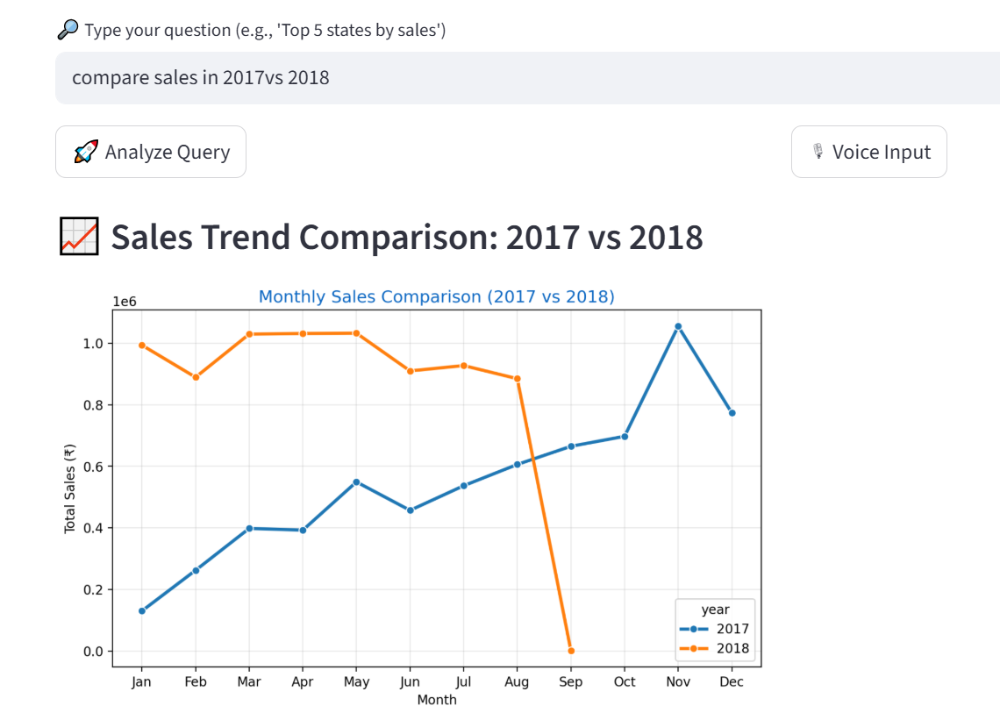
Blue line indicates year 2017  and orange line indicates year 2018 where we can see there is a sharp dip in year 2018 after august month because the data is till august 2018
## Compare sales in 2017 vs 2018 for top 10 States
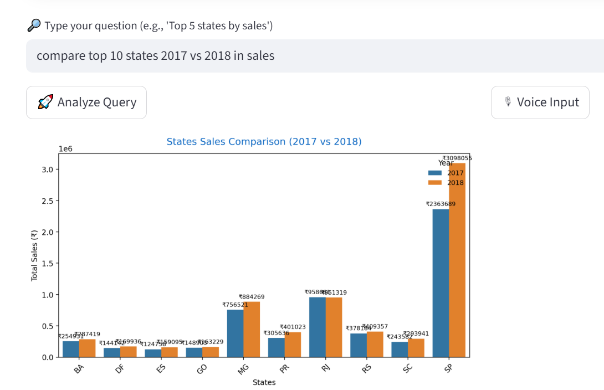
Here it gives comparies of top 10 states in sales in the year 2017 and 2018 where blue color indicates year 2017 and orange color indicates year 2018
## Forecasting sales for next 6 months for top 5 states in sales through voice
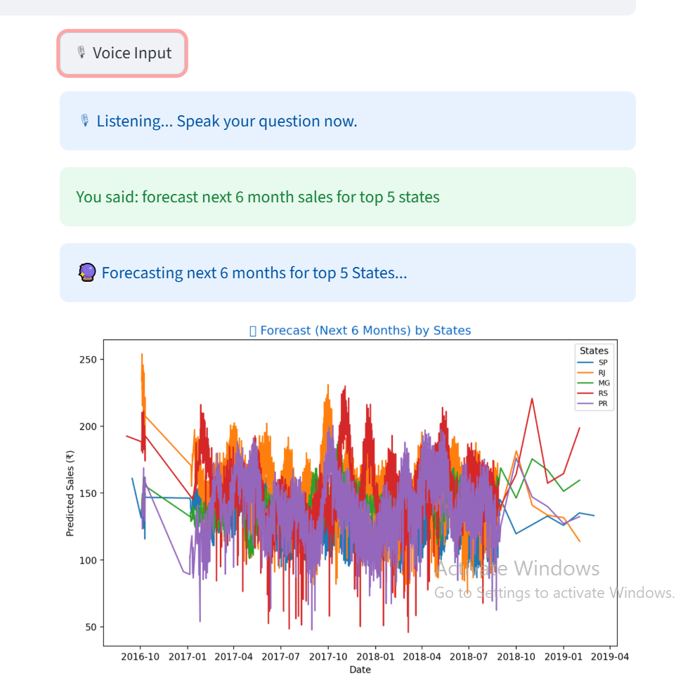
Here it uses prophet and tqdm libraries uses and by analysing previous trends and previous data ,it will predict or forecast next 6 months sales for top 5 states
It is giving through my voice command 
## What is 2nd highest payment method used by customers?
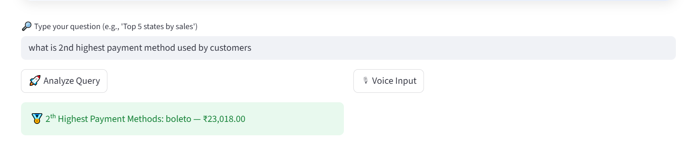
## What is 2nd lowest state in sales?
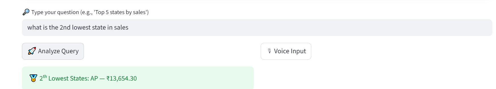
## What is 3rd highest city in sales?
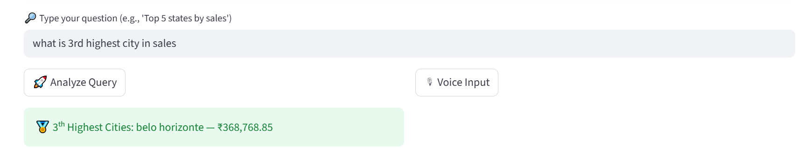
## Compare sales in Q1 2017 vs Q1 2018
Here it is comparing sales in first three months in 2017 and first three months in 2018 i.e January,February,March
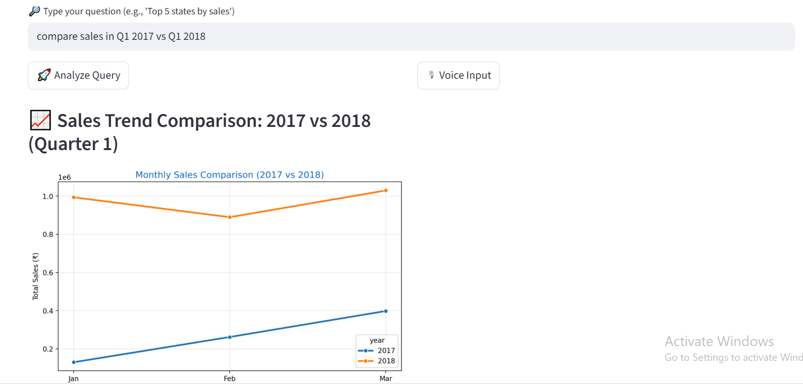
## KPI's
This section will help users to know breifly about dataset and count of the important values so basically user knows what does dataset contains and what is the size of data
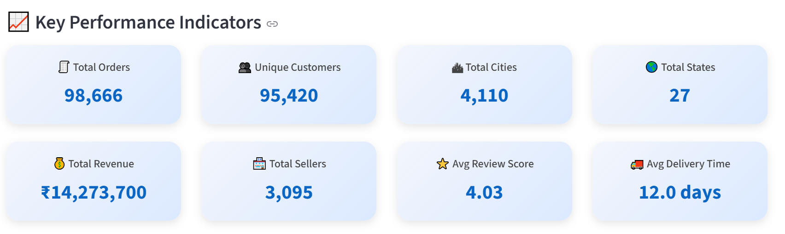

